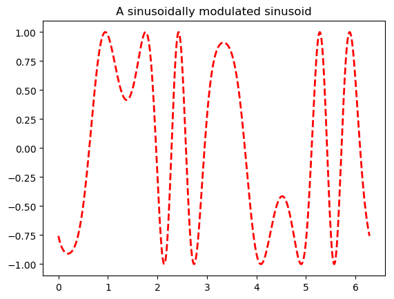

```julia
using PyPlot
x = linspace(0,2*pi,1000); y = sin.(3 * x + 4 * cos.(2 * x));
plot(x, y, color="red", linewidth=2.0, linestyle="--")
title("A sinusoidally modulated sinusoid")
```





    PyObject Text(0.5,1,u'A sinusoidally modulated sinusoid')


