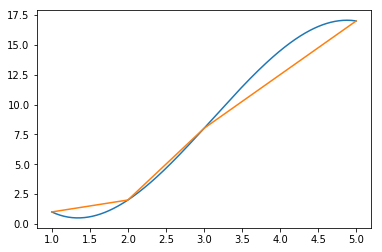

# how to smooth curve


```python
import matplotlib.pyplot as plt
import numpy as np
from scipy import interpolate

x = np.array([1,2,3,5])
y = np.array([1,2,8,17])

s = interpolate.InterpolatedUnivariateSpline(x, y)
xnew = np.linspace(x.min(), x.max(), 300)
ynew = s(xnew)

plt.figure()
plt.plot(xnew, ynew)
plt.plot(x, y)
plt.show()
```




